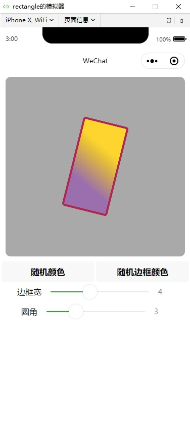

# 矩形示例
## 说明
可通过```Rectangle```类创建一个矩形对象：
```javascript
    // graph是一个已经创建好的Graph对象

    let w = 100,h=100;

    let rect = new Rectangle({
          width: w,
          height: h,
    });
    graph.addChild(rect);
```
通过```graph.update```方法刷新即可看到绘制的矩形。

本示例中用到了```graph.startRAF```定时绘制的方法，便于展示一个不停旋转的矩形。

## 小程序代码片段连接
https://developers.weixin.qq.com/s/DLKwRlmI7ihs

(如果无法导入请直接下载代码)

## 示例截图
